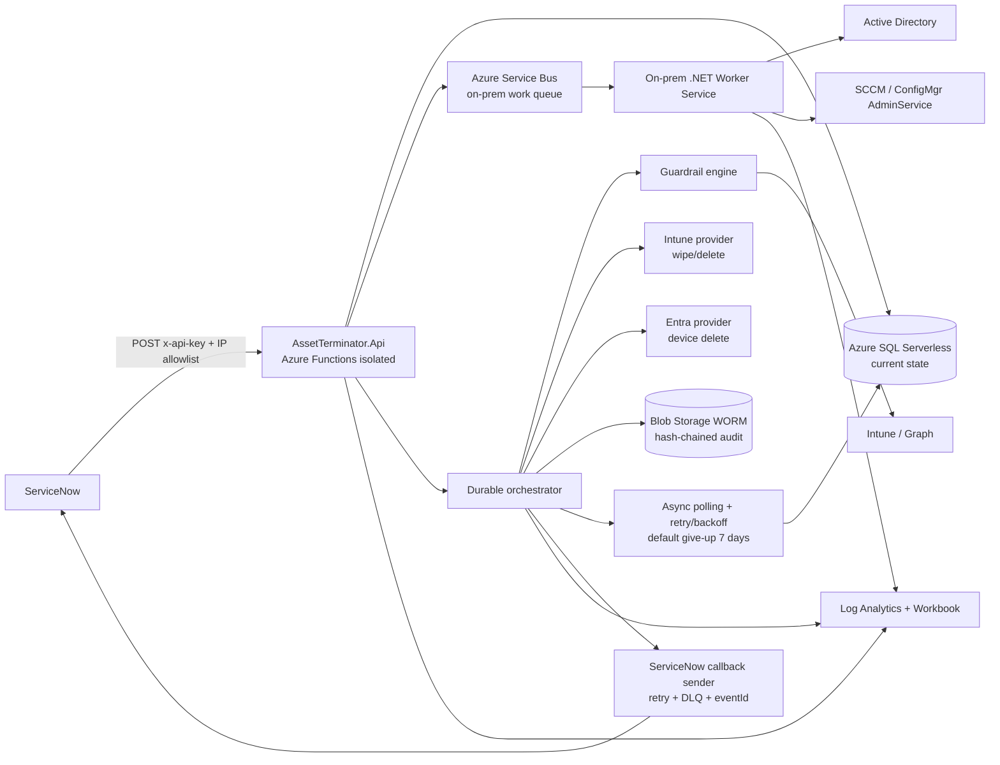

<div align="center">

# 🛡️ Asset-Terminator

### ServiceNow-driven, guardrail-protected asset decommissioning for Microsoft estates

*Securely retire devices across **Active Directory**, **SCCM/ConfigMgr**, **Microsoft Intune** and **Entra ID** — with immutable audit, async tracking, SLA enforcement and a wipe that only fires when it is safe to.*

[](https://dotnet.microsoft.com/)
[](https://learn.microsoft.com/azure/azure-functions/)
[](https://learn.microsoft.com/azure/azure-functions/durable/)
[](https://learn.microsoft.com/graph/)
[](https://learn.microsoft.com/azure/azure-resource-manager/bicep/)
[](#-build--test)
[](LICENSE)
[](#-contributing)

</div>

---

## 📑 Table of contents

- [✨ Why Asset-Terminator](#-why-asset-terminator)
- [🚀 Key features](#-key-features)
- [🏗️ Architecture](#️-architecture)
- [🧰 Tech stack](#-tech-stack)
- [📂 Solution layout](#-solution-layout)
- [📊 Project stats](#-project-stats)
- [⚙️ Prerequisites](#️-prerequisites)
- [🔨 Build & test](#-build--test)
- [☁️ Deployment](#️-deployment)
- [🔌 REST API](#-rest-api)
- [🔁 End-to-end flow](#-end-to-end-flow)
- [🚧 Guardrails](#-guardrails)
- [🧪 Dry-run](#-dry-run)
- [✅ Override workflow](#-override-workflow)
- [⏱️ SLA tiers](#️-sla-tiers)
- [🔒 Immutable audit & tamper evidence](#-immutable-audit--tamper-evidence)
- [🛡️ Security & permissions](#️-security--permissions)
- [📈 Observability](#-observability)
- [📚 Documentation](#-documentation)
- [🤝 Contributing](#-contributing)
- [📄 License](#-license)

---

## ✨ Why Asset-Terminator

Decommissioning a corporate device is rarely a single click. The object lives in **Active Directory**, **SCCM/ConfigMgr**, **Intune** and **Entra ID**, and a remote **wipe** is destructive and irreversible. Asset-Terminator turns this risky, manual, multi-system chore into a **single idempotent REST call from ServiceNow** that is:

- 🔐 **Safe** — a remote wipe only runs when *every* mandatory guardrail passes (e.g. disk encryption verified).
- 🧾 **Auditable** — every decision and action is written to **WORM immutable, hash-chained** storage.
- ⏳ **Resilient over time** — devices can be offline for days; async tracking polls until success, timeout or give-up.
- 🔁 **Idempotent** — the same `requestId` never triggers a second execution.

---

## 🚀 Key features

| | Feature | Description |
|---|---|---|
| 🧹 | **Multi-system cleanup** | Removes the device object from Active Directory, SCCM/ConfigMgr, Intune and Entra ID behind a common provider interface. |
| 💣 | **Guarded Intune wipe** | Executes the Microsoft Graph managed-device wipe **only after** all mandatory guardrails pass. |
| 🚧 | **Extensible guardrail engine** | Pluggable `IWipeGuardrail` rules — encryption, inactivity, critical-group — configurable as *mandatory* or *warning* without recompiling. |
| 🧾 | **Immutable audit** | Append-only, hash-chained records in Azure Blob WORM storage for tamper-evident compliance. |
| ⏱️ | **Async state tracking** | Per-action state machine with polling, retry/backoff and a configurable give-up timeout (default 7 days). |
| 📡 | **ServiceNow callbacks** | Push notifications with retry, dead-letter and idempotent `eventId` on every meaningful state change. |
| 🎚️ | **SLA tiers** | `Standard` / `Vip` / `Critical` categories drive deadlines, prioritisation and escalation. |
| 👮 | **RBAC & override** | Entra-backed roles (Operator / Auditor / Admin / Approver) with an audited guardrail-override workflow. |
| 🧪 | **Dry-run mode** | Simulate the whole flow — validation, guardrails, planning — with **no** destructive action. |
| 📈 | **Built-in observability** | Structured telemetry to Log Analytics custom tables, ready-made KQL queries and a workbook. |

---

## 🏗️ Architecture



> 📖 For the full component breakdown, the rationale behind every design decision, and the request-flow & state-machine diagrams, see **[`docs/architecture.md`](docs/architecture.md)**.

---

## 🧰 Tech stack

| Layer | Technology |
|---|---|
| **Language / runtime** | C# · .NET 10 (isolated worker) |
| **Compute** | Azure Functions (Flex Consumption) + Durable Functions orchestration |
| **On-prem agent** | Self-hosted .NET Worker Service (pull model via Service Bus) |
| **State store** | Azure SQL Database Serverless (EF Core) |
| **Immutable audit** | Azure Blob Storage — WORM time-based retention, hash-chained records |
| **Messaging** | Azure Service Bus (orchestration / cloud / on-prem / dead-letter queues) |
| **Identity & access** | Microsoft Graph SDK · per-capability User-Assigned Managed Identities · Entra ID RBAC |
| **Secrets** | Azure Key Vault (no secrets in code) |
| **Observability** | Log Analytics custom tables · KQL · Azure Monitor Workbook |
| **IaC** | Bicep + PowerShell deployment script |
| **Testing** | xUnit + Moq |

---

## 📂 Solution layout

<details>
<summary><b>Source projects (15)</b></summary>

| Project | Responsibility |
|---|---|
| `src/AssetTerminator.Api` | ServiceNow-facing Functions API: intake, status, history, override. |
| `src/AssetTerminator.Contracts` | Shared REST DTOs and enums (`DecommissionRequest`, responses, overrides, callbacks). |
| `src/AssetTerminator.Core` | Core domain services, workflow abstractions, state models. |
| `src/AssetTerminator.Guardrails` | Guardrail engine + encryption / inactivity / critical-group implementations. |
| `src/AssetTerminator.Infrastructure` | Azure SQL, Blob audit, Service Bus, Key Vault, logging, persistence. |
| `src/AssetTerminator.OnPremAgent` | Self-hosted worker performing on-prem AD & SCCM actions. |
| `src/AssetTerminator.Orchestrator` | Durable orchestration, retries, polling, SLA, callback scheduling. |
| `src/AssetTerminator.Providers.ActiveDirectory` | AD computer-object delete provider. |
| `src/AssetTerminator.Providers.ConfigMgr` | SCCM / ConfigMgr AdminService provider. |
| `src/AssetTerminator.Providers.EntraId` | Microsoft Graph Entra ID device lookup & delete. |
| `src/AssetTerminator.Providers.Intune` | Microsoft Graph Intune wipe / retire / read / delete, plus Windows Autopilot device delete. |
| `src/AssetTerminator.Providers.DeviceActions` | On-device pre-wipe preventive actions (Enterprise→Pro license step-down, OEM BIOS password removal) executed by the on-prem agent. |

</details>

<details>
<summary><b>Test projects (4)</b></summary>

| Project | Coverage |
|---|---|
| `tests/AssetTerminator.Api.Tests` | Validation, authorization, idempotency, endpoint behavior. |
| `tests/AssetTerminator.Guardrails.Tests` | Guardrail policy and signal evaluation. |
| `tests/AssetTerminator.Orchestrator.Tests` | Durable orchestration, retry, polling, callback, SLA. |
| `tests/AssetTerminator.Providers.Tests` | Provider contract tests for cloud and on-prem adapters. |

</details>

---

## 📊 Project stats

| Metric | Value |
|---|---|
| 📦 Projects | **19** (15 source · 4 test) |
| 💻 C# code | **~4,850 lines** across 75 files |
| 🧱 Infrastructure (Bicep) | **~620 lines** across 9 modules |
| 📜 OpenAPI contract | 495 lines |
| ✅ Automated tests | **34 passing** |
| 🎯 Target framework | .NET 10 |

---

## ⚙️ Prerequisites

- .NET 10 SDK
- Azure CLI
- Azure Functions Core Tools
- An Azure subscription able to deploy Functions, SQL, Storage, Service Bus, Key Vault, managed identities, Log Analytics and RBAC assignments
- Entra administrator consent for the required Microsoft Graph application permissions on the UAMI service principals

---

## 🔨 Build & test

```powershell
dotnet build src\AssetTerminator.slnx -c Release
dotnet test  src\AssetTerminator.slnx -c Release
```

---

## ☁️ Deployment

Provision Azure infrastructure and app resources:

```powershell
.\infra\deploy.ps1
```

After deployment: complete tenant-level Graph app-role consent for the user-assigned managed identities, configure ServiceNow callback endpoints, and store API keys/secrets in Key Vault.

---

## 🔌 REST API

The contract is documented in **[`docs/openapi.yaml`](docs/openapi.yaml)**. ServiceNow authenticates with the `x-api-key` header and must originate from an allowed IP range.

| Method | Route | Purpose |
|---|---|---|
| `POST` | `/api/v1/decommission` | Accepts a `DecommissionRequest`, returns `DecommissionAccepted`. |
| `GET` | `/api/v1/decommission/{requestId}` | Returns `DecommissionStatusResponse`. |
| `GET` | `/api/v1/decommission/{requestId}/history` | Returns immutable history events. |
| `POST` | `/api/v1/decommission/{requestId}/override` | Approver guardrail override. |

> 🔑 `requestId` is the **idempotency key** — duplicate submissions return the original workflow and never trigger a second execution.

---

## 🔁 End-to-end flow

1. ServiceNow submits a `DecommissionRequest` with identifiers, `deviceType`, `assetCategory`, `dispositionType`, `requestedActions` and optional `dryRun`.
2. The API validates API key, IP allowlist, required fields, enum values, disposition rules and idempotency.
3. Current state is written to Azure SQL and an immutable audit event to WORM Blob Storage.
4. Durable Functions sequences the requested actions per disposition and dispatches cloud or on-prem work.
5. **Terminate** deletes the device object (AD/SCCM/Intune/Entra) and removes it from **Windows Autopilot**, then runs config-gated **pre-wipe preventive actions** (Enterprise→Pro license step-down, OEM BIOS password removal) on the device via the on-prem agent, and only wipes once they complete.
6. **Retire** (re-purpose) deletes the device object and issues the Intune *retire* action — **no wipe, no Autopilot deletion, no preventive actions**.
7. Mandatory guardrails gate the wipe — `EncryptionGuardrail` must pass; Inactivity / CriticalGroup are configurable; incomplete required pre-wipe actions block the wipe.
8. Intune & Entra actions call Microsoft Graph with least-privilege UAMIs; AD, SCCM, license and BIOS work is queued to Service Bus for the on-prem worker.
9. The async tracking engine polls long-running status with retry/backoff and a configurable give-up timeout (default 7 days).
10. Callback events are pushed to ServiceNow with retry, dead-letter and idempotent `eventId`.
11. Telemetry flows to Log Analytics for workbook reporting and KQL analysis.

### Disposition types

| Disposition | Deletes (AD/SCCM/Intune/Entra) | Autopilot delete | Pre-wipe preventive actions | Intune action |
|---|---|---|---|---|
| **Terminate** (default) | ✅ | ✅ (Windows, if `serialNumber`) | ✅ license + BIOS (config-gated) | **Wipe** |
| **Retire** (re-purpose) | ✅ | ❌ | ❌ | **Retire** |

Pre-wipe preventive actions are auto-injected at intake for a Windows Terminate+Wipe and gated by
`AssetTerminator:PreWipe` options (`DeleteFromAutopilot`, `RemoveEnterpriseLicense`, `RemoveBiosPassword`,
`RequireCompletionBeforeWipe`). License step-down and BIOS password removal run on the device through the
on-prem agent (`AssetTerminator.Providers.DeviceActions`).

---

## 🚧 Guardrails

Guardrails are configured under the `AssetTerminator:Guardrails` section. Each can be enabled/disabled, given thresholds and marked **Mandatory** or **Warning**.

```json
{
  "AssetTerminator": {
    "Guardrails": {
      "EncryptionGuardrail": {
        "Enabled": true,
        "Mode": "Mandatory",
        "RequireBitLockerEscrow": true,
        "RequireFileVaultEscrow": true
      },
      "InactivityGuardrail": {
        "Enabled": true,
        "Mode": "Warning",
        "MinimumInactiveDays": 14
      },
      "CriticalGroupGuardrail": {
        "Enabled": true,
        "Mode": "Mandatory",
        "BlockedGroups": [ "Domain Admins", "Executive Devices" ]
      }
    }
  }
}
```

❌ A **Mandatory** failure blocks the destructive wipe → status `BLOCKED`.
⚠️ **Warning** guardrails are audited and surfaced in status/history but do not block.

Add a custom rule by implementing `IWipeGuardrail` and registering it — no core changes required.

---

## 🧪 Dry-run

Set `dryRun: true` in the request to simulate the full workflow — validation, identity resolution, guardrails, planning, SLA and callbacks — **without** any destructive wipe/delete. Dry-run results are still persisted to SQL, audit and history so ServiceNow automation can be validated safely.

---

## ✅ Override workflow

A guardrail block can be overridden by an **Approver**:

```
POST /api/v1/decommission/{requestId}/override
```

The request carries a **mandatory reason** and optional `guardrailIds`. The reason, actor, affected guardrails and outcome are written to immutable audit **before** the orchestrator resumes eligible work. Multi-approval can be required for VIP/Critical assets.

---

## ⏱️ SLA tiers

| Category | Behaviour |
|---|---|
| 🟢 `Standard` | Normal decommission target. |
| 🟠 `Vip` | Shorter deadline, earlier at-risk notification. |
| 🔴 `Critical` | Most restrictive routing, escalation and approval. |

Each request exposes `slaState` (`WithinSla` / `AtRisk` / `Breached`), `dueAt` and `overallStatus` for ServiceNow polling and reporting.

---

## 🔒 Immutable audit & tamper evidence

Azure SQL holds **mutable current state** for fast API reads. Compliance audit lives separately in **Azure Blob Storage with WORM time-based retention**. Each record embeds the **previous record's hash** plus its own — a per-request **hash chain**. Any modification, deletion or reordering breaks the chain and is detectable during verification.

---

## 🛡️ Security & permissions

See **[`docs/permissions.md`](docs/permissions.md)** for the least-privilege permission matrix.

- 🔑 Inbound requests require an API key (`x-api-key`) stored in Key Vault + IP allowlisting.
- 🆔 Each cloud capability uses a **separate UAMI** to isolate privilege.
- 🏢 On-prem AD/SCCM deletes never require Microsoft Graph permissions.
- 🔁 Replay protection via idempotent `requestId`.

---

## 📈 Observability

Telemetry is sent to Log Analytics custom tables — `DecommissionRequests_CL`, `DecommissionActions_CL`, `GuardrailResults_CL`, `CallbackEvents_CL`. Ready-made queries live in **[`docs/kql/queries.kql`](docs/kql/queries.kql)** for status counts, completion time, retries, failure rate, device distribution, SLA compliance and pending SLA breaches.

---

## 📚 Documentation

| Document | Contents |
|---|---|
| [`docs/architecture.md`](docs/architecture.md) | Components, design rationale, request-flow & state-machine diagrams. |
| [`docs/openapi.yaml`](docs/openapi.yaml) | Full REST contract with payload examples. |
| [`docs/permissions.md`](docs/permissions.md) | Least-privilege permission matrix per action. |
| [`docs/kql/queries.kql`](docs/kql/queries.kql) | Operational KQL query library. |

---

## 🤝 Contributing

Contributions are welcome! Please open an issue to discuss substantial changes first, keep PRs focused, and make sure `dotnet build` and `dotnet test` pass before submitting.

---

## 📄 License

Released under the **MIT License** — see [`LICENSE`](LICENSE).

---

<div align="center">

Built with ❤️ for secure, auditable device lifecycle management on Microsoft estates.

</div>
