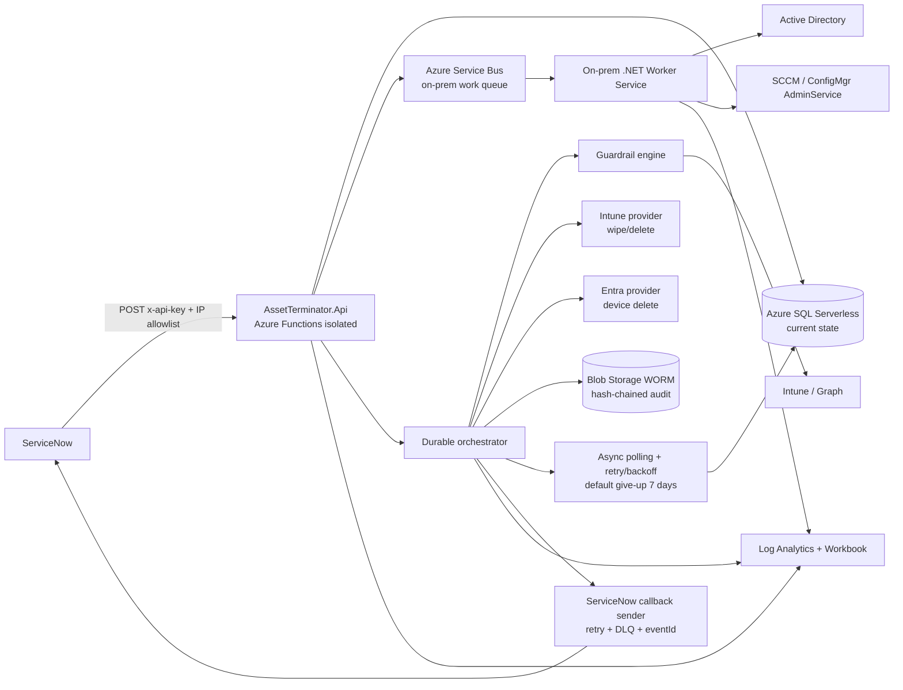

# Asset-Terminator

Asset-Terminator is a .NET 10 Azure solution for ServiceNow-driven asset decommissioning. It accepts decommission requests, evaluates guardrails, orchestrates cloud and on-premises deletes, tracks long-running asynchronous work, and writes immutable audit records for compliance.

## Architecture

The solution runs on Azure Functions isolated on Flex Consumption with Durable Functions. Azure SQL Database Serverless stores current workflow state. Azure Blob Storage with WORM time-based retention stores immutable, hash-chained audit records. On-premises Active Directory and SCCM actions are executed by a self-hosted .NET Worker Service that polls Azure Service Bus. Intune and Entra ID actions use Microsoft Graph through per-capability user-assigned managed identities.



For a detailed component breakdown, the rationale behind each design decision, and the full request-flow and state-machine diagrams, see [`docs\architecture.md`](docs/architecture.md).

## Solution layout

### Source projects

- `src\AssetTerminator.Api` — ServiceNow-facing Azure Functions API for intake, status, history, and override endpoints.
- `src\AssetTerminator.Contracts` — Shared REST DTOs and enums, including `DecommissionRequest`, response models, overrides, callbacks, and target/device/category enums.
- `src\AssetTerminator.Core` — Core domain services, workflow abstractions, state models, and shared orchestration contracts.
- `src\AssetTerminator.Guardrails` — Guardrail engine and guardrail implementations such as encryption, inactivity, and critical group checks.
- `src\AssetTerminator.Infrastructure` — Azure SQL, Blob audit, Service Bus, Key Vault, logging, and persistence integrations.
- `src\AssetTerminator.OnPremAgent` — Self-hosted worker service that polls Service Bus and performs on-premises AD and SCCM actions.
- `src\AssetTerminator.Orchestrator` — Durable Functions orchestration, retries, polling, SLA checks, callback scheduling, and action sequencing.
- `src\AssetTerminator.Providers.ActiveDirectory` — Active Directory provider used by the on-prem worker to delete computer objects.
- `src\AssetTerminator.Providers.ConfigMgr` — SCCM / ConfigMgr AdminService provider used by the on-prem worker.
- `src\AssetTerminator.Providers.EntraId` — Microsoft Graph provider for Entra ID device lookup and delete.
- `src\AssetTerminator.Providers.Intune` — Microsoft Graph provider for Intune managed device wipe, retire, read, and delete operations.

### Test projects

- `tests\AssetTerminator.Api.Tests` — API validation, authorization, idempotency, and endpoint behavior tests.
- `tests\AssetTerminator.Guardrails.Tests` — Guardrail policy and signal evaluation tests.
- `tests\AssetTerminator.Orchestrator.Tests` — Durable orchestration, retry, polling, callback, and SLA workflow tests.
- `tests\AssetTerminator.Providers.Tests` — Provider contract tests for cloud and on-prem action adapters.

## Prerequisites

- .NET 10 SDK
- Azure CLI
- Azure Functions Core Tools
- Access to an Azure subscription with permissions to deploy Functions, SQL, Storage, Service Bus, Key Vault, managed identities, Log Analytics, and RBAC assignments
- Entra administrator consent for Microsoft Graph application permissions on the required UAMI service principals

## Build and test

```powershell
dotnet build src\AssetTerminator.slnx -c Release
dotnet test src\AssetTerminator.slnx -c Release
```

## Deployment

Deploy Azure infrastructure and app resources with:

```powershell
.\infra\deploy.ps1
```

After deployment, complete tenant-level Graph app role consent for the user-assigned managed identities, configure ServiceNow callback endpoints, and store API keys/secrets in Key Vault.

## REST API

The REST contract is documented in `docs\openapi.yaml`. ServiceNow authenticates with the `x-api-key` header and must originate from an allowed IP range. The primary operations are:

- `POST /api/v1/decommission` — accepts a `DecommissionRequest` and returns `DecommissionAccepted`.
- `GET /api/v1/decommission/{requestId}` — returns `DecommissionStatusResponse`.
- `GET /api/v1/decommission/{requestId}/history` — returns immutable `DecommissionHistoryEvent` records.
- `POST /api/v1/decommission/{requestId}/override` — accepts an `OverrideRequest` from an Approver.

`requestId` is the idempotency key. Duplicate submissions return the original accepted workflow and never trigger a second execution.

## End-to-end flow

1. ServiceNow submits a `DecommissionRequest` with `requestId`, asset identifiers, `deviceType`, `assetCategory`, `requestedActions`, and optional `dryRun`.
2. The API validates the API key, IP allowlist, required fields, enum values, and idempotency.
3. Current state is written to Azure SQL and an immutable audit event is written to WORM Blob Storage.
4. Durable Functions sequences requested actions and dispatches cloud or on-prem work.
5. Mandatory guardrails gate wipe. `EncryptionGuardrail` must pass, and examples such as Inactivity and CriticalGroup can be configured as mandatory or warning.
6. Intune and Entra actions call Microsoft Graph with least-privilege UAMIs. AD and SCCM work is queued to Service Bus for the on-prem worker.
7. The async tracking engine polls for long-running status, using retry with backoff and a configurable give-up timeout, defaulting to 7 days.
8. Callback events are pushed to ServiceNow with retry, dead-letter handling, and idempotent `eventId`.
9. Logs flow to Log Analytics for workbook reporting and KQL analysis.

## Guardrail configuration

Guardrails are configured through the `AssetTerminator:Guardrails` configuration section. Each guardrail can be enabled or disabled, assigned thresholds, and marked as mandatory or warning-only.

Example shape:

```json
{
  "AssetTerminator": {
    "Guardrails": {
      "EncryptionGuardrail": {
        "Enabled": true,
        "Mode": "Mandatory",
        "RequireBitLockerEscrow": true,
        "RequireFileVaultEscrow": true
      },
      "InactivityGuardrail": {
        "Enabled": true,
        "Mode": "Warning",
        "MinimumInactiveDays": 14
      },
      "CriticalGroupGuardrail": {
        "Enabled": true,
        "Mode": "Mandatory",
        "BlockedGroups": [ "Domain Admins", "Executive Devices" ]
      }
    }
  }
}
```

Mandatory guardrail failures block destructive wipe. Warning guardrails are audited and surfaced in status/history, but do not block unless policy changes them to mandatory.

## Dry-run usage

Set `dryRun` to `true` in `DecommissionRequest` to simulate the workflow. Dry-run evaluates request validation, identity resolution, guardrails, action planning, SLA calculation, and callbacks without performing destructive wipe/delete operations. Dry-run results are still written to SQL, audit storage, and history so ServiceNow can validate automation safely.

## Override workflow

Guardrail override requires the Approver role. An Approver calls `POST /api/v1/decommission/{requestId}/override` with an `OverrideRequest` containing a mandatory `reason` and optional `guardrailIds`. The reason, actor, affected guardrails, and resulting action are written to immutable audit storage before the orchestrator resumes eligible work.

## SLA configuration

SLA is driven by `assetCategory`:

- `Standard` — normal decommission target.
- `Vip` — shorter deadline and earlier at-risk notification.
- `Critical` — most restrictive routing, escalation, and approval behavior.

Configure category-specific durations, at-risk windows, and callback escalation policies in application configuration. Requests expose `slaState`, `dueAt`, and `overallStatus` for ServiceNow polling and reporting.

## Immutable audit and tamper evidence

Azure SQL stores mutable current state for efficient API reads. Compliance audit is stored separately in Azure Blob Storage with WORM time-based retention. Each audit record includes the previous record hash and its own hash, forming a hash chain per request. Any modification, deletion, or reordering breaks the chain and can be detected during audit verification.

## Security and permissions

See `docs\permissions.md` for the least-privilege permission matrix. Inbound ServiceNow requests require an API key in `x-api-key`, storage in Key Vault, IP allowlisting, and idempotency via `requestId`. Cloud actions use separate UAMIs per capability to isolate privilege, and on-premises AD/SCCM deletes never require Microsoft Graph permissions.

## Observability

Application telemetry is sent to Log Analytics custom tables including `DecommissionRequests_CL`, `DecommissionActions_CL`, `GuardrailResults_CL`, and `CallbackEvents_CL`. Query examples are available in `docs\kql\queries.kql` for status counts, completion time, retries, failure rate, device distribution, SLA compliance, and pending SLA breaches.
