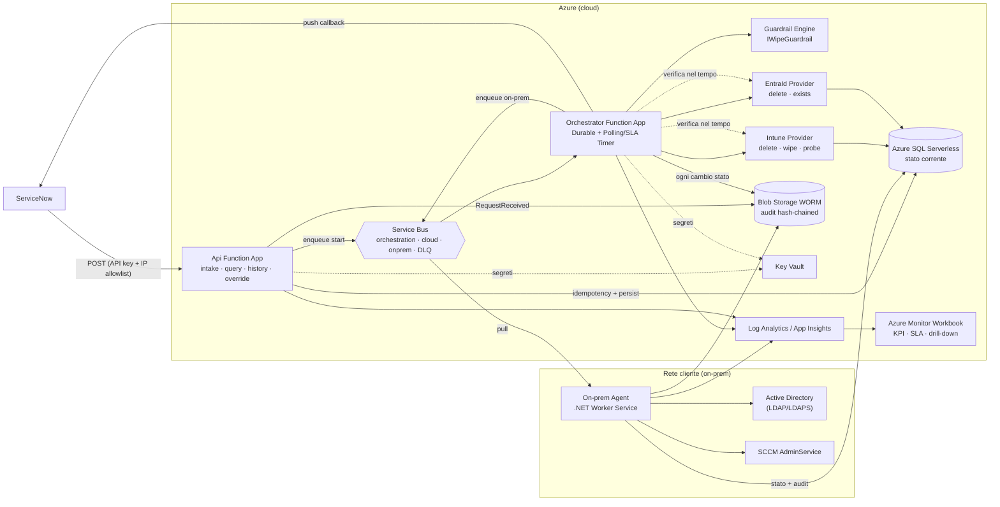
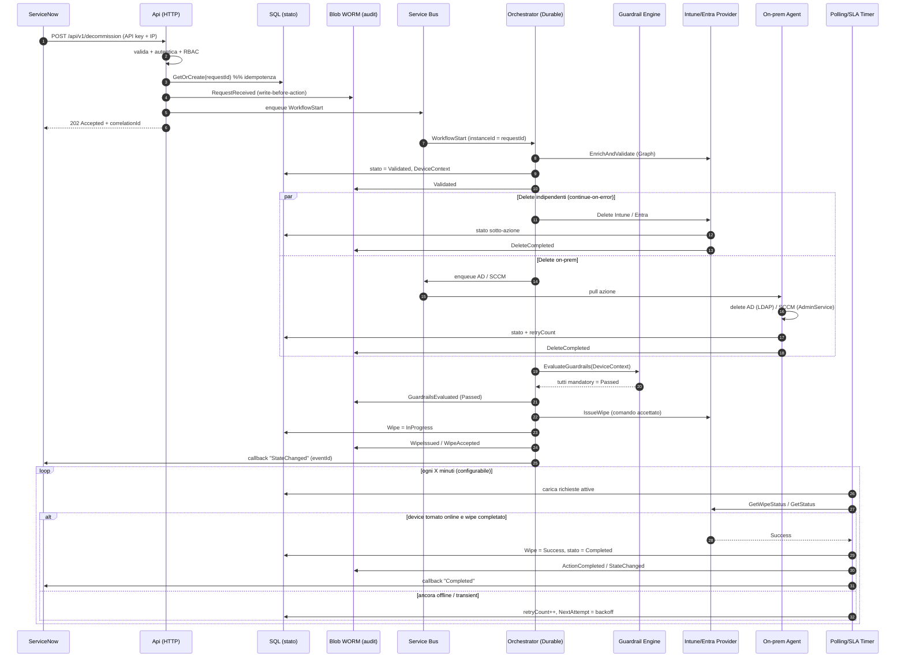
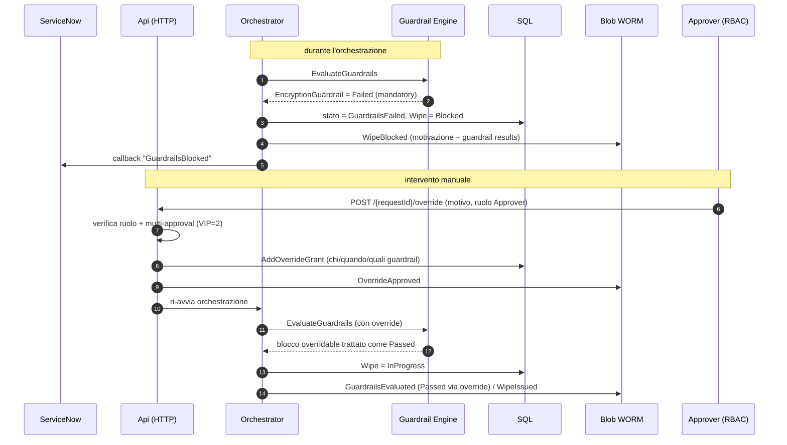
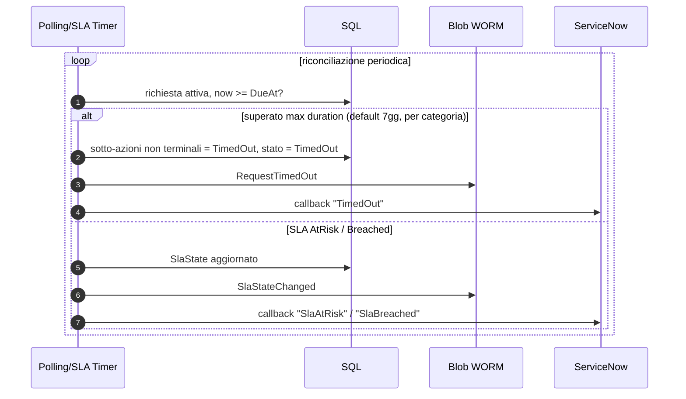
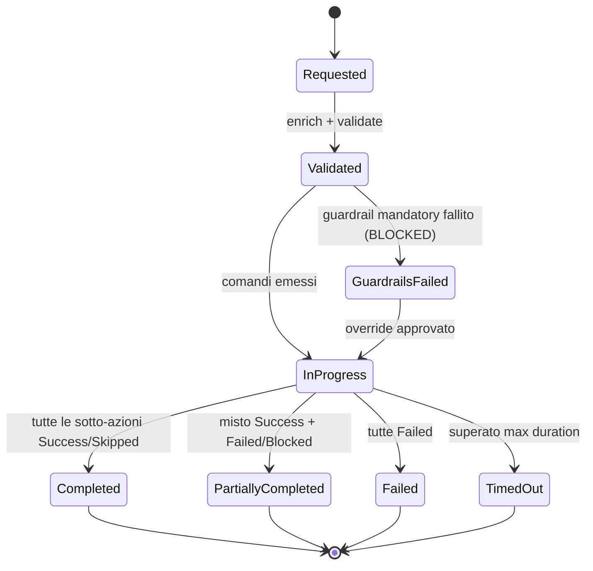

# Asset-Terminator — Documento di Architettura

> Orchestratore di **dismissione asset** guidato da ServiceNow. Riceve richieste di
> decommission via REST, rimuove l'oggetto dispositivo da Active Directory, SCCM,
> Microsoft Intune ed Entra ID, esegue il **wipe** Intune solo dopo il superamento dei
> **guardrail**, traccia ogni sotto-azione asincrona nel tempo, invia **callback** a
> ServiceNow, scrive un **audit immutabile**, applica gli **SLA** per categoria di asset,
> supporta **RBAC + override** con approvazione ed espone una **dashboard** operativa.

Indice:
1. [Panoramica](#1-panoramica)
2. [Componenti della soluzione](#2-componenti-della-soluzione)
3. [Decisioni architetturali e razionali](#3-decisioni-architetturali-e-razionali)
4. [Diagramma dei componenti](#4-diagramma-dei-componenti)
5. [Flusso delle richieste](#5-flusso-delle-richieste)
6. [Macchina a stati](#6-macchina-a-stati)
7. [Aspetti trasversali](#7-aspetti-trasversali-cross-cutting)
8. [Sicurezza e least privilege](#8-sicurezza-e-least-privilege)
9. [Input specifici dell'ambiente cliente](#9-input-specifici-dellambiente-cliente)

---

## 1. Panoramica

La soluzione è un sistema **event-driven**, **idempotente** e **completamente auditabile**
costruito su **.NET 10 (isolated worker)** e ospitato su **Azure Functions (Flex
Consumption)** con orchestrazione **Durable Functions**. È strutturata secondo il pattern
**immutable core + capability plug-in**: un nucleo stabile di contratti e astrazioni
(`AssetTerminator.Core`) verso cui tutti gli altri componenti (provider, guardrail,
infrastruttura, host) si implementano e vengono risolti via Dependency Injection.

Principi guida:

| Principio | Implementazione |
| --- | --- |
| **Disaccoppiamento** | ingestion, orchestrazione, esecuzione on-prem e callback comunicano via Service Bus / state store, non con chiamate dirette. |
| **Idempotenza** | `requestId` è la chiave di idempotenza end-to-end (HTTP intake, instance id Durable, MessageId Service Bus). |
| **Write-before-action** | l'intento viene scritto nell'audit immutabile **prima** di ogni operazione distruttiva. |
| **Guardrail gate** | il wipe procede solo se **tutti** i guardrail obbligatori passano. |
| **Continue-on-error** | una sotto-azione fallita non interrompe l'intero flusso; il report finale aggrega gli esiti. |
| **Config-driven** | guardrail, SLA, URL callback, timeout: tutto da configurazione / Key Vault, senza ricompilare. |
| **Completamento asincrono** | un device offline per giorni viene riconciliato nel tempo dal polling engine fino a successo o timeout. |

---

## 2. Componenti della soluzione

### 2.1 Progetti — libreria di dominio condivisa

| Progetto | Ruolo | Note |
| --- | --- | --- |
| **AssetTerminator.Contracts** | DTO REST in ingresso/uscita ed enum pubblici (`DecommissionRequest`, `ServiceNowCallback`, `DecommissionTarget`, `DeviceType`, `AssetCategory`). | Superficie stabile esposta a ServiceNow. |
| **AssetTerminator.Core** | Modello di dominio, macchina a stati, **astrazioni** (`IDeviceCleanupProvider`, `IWipeProvider`, `IWipeGuardrail`, `IGuardrailEngine`, `IStateStore`, `IAuditWriter`, `ICallbackSender`, `IActionDispatcher`, `ISlaCalculator`, `IDeviceEnricher`, `IOperationalTelemetry`, `IWorkflowStarter`) e classi di **Options**. | Nessuna dipendenza da Azure SDK: è il contratto verso cui tutto si implementa. |

### 2.2 Progetti — infrastruttura e capability

| Progetto | Ruolo | Tecnologie chiave |
| --- | --- | --- |
| **AssetTerminator.Infrastructure** | Implementazioni concrete delle astrazioni: state store SQL, audit WORM hash-chained, dispatch Service Bus, Key Vault, Graph client factory, callback resilienti, calcolo SLA, telemetria Log Analytics. | EF Core, Azure.Storage.Blobs, Azure.Messaging.ServiceBus, Azure.Security.KeyVault, Polly, Azure.Monitor.Ingestion. |
| **AssetTerminator.Guardrails** | Motore guardrail estensibile + guardrail predefiniti: `EncryptionGuardrail` (BitLocker/FileVault), `InactivityGuardrail`, `CriticalGroupGuardrail`. | Plug-in via DI; ogni guardrail config-driven (enabled / threshold / mandatory|warning / overridable). |
| **AssetTerminator.Providers.Intune** | Delete del managed device + **wipe** + **retire** + delete da **Windows Autopilot** + verifica stato via Microsoft Graph. | Microsoft.Graph; UAMI dedicata. |
| **AssetTerminator.Providers.EntraId** | Delete dell'oggetto device + probe di esistenza via Microsoft Graph. | Microsoft.Graph; UAMI dedicata. |
| **AssetTerminator.Providers.ActiveDirectory** | Delete del computer object via LDAP/LDAPS (on-prem). | System.DirectoryServices.Protocols. |
| **AssetTerminator.Providers.ConfigMgr** | Delete del device via SCCM AdminService REST (on-prem). | HttpClient verso AdminService. |
| **AssetTerminator.Providers.DeviceActions** | Azioni preventive **on-device** eseguite dall'agente on-prem prima del wipe: step-down licenza Enterprise→Windows Pro e rimozione password BIOS via tool OEM (Dell/HP/Lenovo). | Process runner locale; comandi config-driven con placeholder `{serialNumber}`/`{deviceName}`/`{primaryUserUpn}`. |

### 2.3 Progetti — host eseguibili

| Host | Tipo | Responsabilità |
| --- | --- | --- |
| **AssetTerminator.Api** | Azure Functions isolated (HTTP) | Intake `POST /api/v1/decommission`, query `GET /{requestId}`, history `GET /{requestId}/history`, override `POST /{requestId}/override`. Middleware API-key + IP allowlist, RBAC, validazione, idempotenza, dry-run. |
| **AssetTerminator.Orchestrator** | Azure Functions isolated (Durable + Service Bus + Timer) | Orchestrazione Durable (enrich → delete paralleli → wipe gated → finalize), starter Service Bus, **polling/reconciliation engine** (retry+backoff, timeout/give-up, SLA, verifica wipe), pubblicazione callback. |
| **AssetTerminator.OnPremAgent** | .NET Worker Service (self-hosted on-prem) | Consuma la coda Service Bus on-prem, esegue delete AD + SCCM dentro la rete del cliente, riscrive stato e audit. |

### 2.4 Risorse di supporto

| Risorsa | Contenuto |
| --- | --- |
| **infra/** | Bicep modulare: `sql`, `storage` (Blob WORM), `keyvault`, `servicebus`, `functionapp`, `identity` (UAMI), `rbac` (role assignment), `monitoring` (App Insights/LAW + Workbook) + `deploy.ps1`. |
| **docs/** | `openapi.yaml` (contratto REST + esempi ServiceNow), `permissions.md` (matrice permessi least-privilege per azione), `kql/queries.kql` (libreria query), questo `architecture.md`. |
| **tests/** | xUnit + Moq: Guardrail engine, Orchestrator (state machine + reconciliation), API (validazione/idempotenza), Provider (registration). |

---

## 3. Decisioni architetturali e razionali

### 3.1 Hosting: Azure Functions Flex Consumption + Durable Functions
**Scelta.** Host serverless isolated con orchestrazione Durable.
**Razionale.** La dismissione è un workflow **long-running** (un device può restare offline
per giorni): Durable Functions fornisce nativamente persistenza dello stato di
orchestrazione, fan-out/fan-in per le delete parallele e ripresa dopo restart, senza
gestire manualmente un motore di workflow. Flex Consumption dà scalabilità a consumo con
VNet integration per raggiungere risorse private.
**Alternativa considerata.** ASP.NET Core Minimal API containerizzata su Container Apps:
più controllo sul runtime ma richiede di implementare a mano persistenza del workflow e
scheduling. Mantenuta come opzione documentata; Functions+Durable è il default per minor
codice infrastrutturale.

### 3.2 Stato corrente: Azure SQL Database Serverless
**Scelta.** Store transazionale e interrogabile separato dall'audit.
**Razionale.** Lo stato corrente deve essere **mutabile** e **query-able in tempo reale**
(endpoint di polling di ServiceNow, polling engine, dashboard). SQL Serverless offre query
relazionali ricche, auto-pause per contenere i costi e supporto EF Core. Lo stato **non**
va sull'immutabile (che è append-only).
**Alternativa.** Cosmos DB / Azure Table: ottimi per scala/costo ma meno comodi per le
query analitiche puntuali richieste dagli endpoint e dai report.

### 3.3 Audit immutabile: Azure Blob Storage WORM + hash-chain
**Scelta.** Ogni record di audit è scritto come block blob **write-once** (`IfNoneMatch=*`)
sotto `{requestId}/{seq:D8}-{timestamp}.json`, con **immutability policy** time-based
(WORM) e legal-hold opzionale; ogni record include `PreviousHash` + `Hash` (SHA-256) per
formare una **catena tamper-evidence**.
**Razionale.** Il requisito è append-only, non modificabile né cancellabile. La WORM policy
soddisfa la compliance a livello di piattaforma; l'hash-chain rileva manomissioni anche se
una policy venisse allentata. La scrittura precede l'azione distruttiva (write-before-action).
**Alternativa.** Azure SQL Ledger / Azure Data Explorer: validi per tamper-evidence ma il
WORM su Blob è il modo più diretto e a basso costo per ottenere immutabilità reale a livello
di storage, restando indipendente dal datastore di stato.

### 3.4 Messaggistica: Azure Service Bus
**Scelta.** Code separate per orchestrazione, azioni cloud, azioni on-prem e dead-letter
delle callback.
**Razionale.** Disaccoppia ingestion da esecuzione (operazioni long-running) e abilita il
modello **on-prem agent**: l'agente nella rete cliente consuma la coda on-prem senza inbound
firewall. Service Bus fornisce dedup via `MessageId`, dead-letter e retry. `disableLocalAuth`
+ Managed Identity per autenticazione passwordless.

### 3.5 Connettività on-prem: agent self-hosted che fa polling di una coda
**Scelta.** AD e SCCM vengono dismessi da un Worker Service eseguito **dentro** la rete del
cliente, che fa polling della coda Service Bus on-prem e riscrive stato/audit.
**Razionale.** AD (LDAP) e SCCM AdminService non sono raggiungibili dal cloud senza
esposizione. Il pattern **pull** (l'agente apre connessioni in uscita verso Service Bus,
SQL e Blob) evita di aprire porte in ingresso verso l'on-prem ed è il modello a minor
superficie d'attacco.

### 3.6 Pattern provider: capability plug-in dietro interfaccia comune
**Scelta.** Ogni ambiente implementa `IDeviceCleanupProvider` (`Exists`/`Delete`/`GetStatus`);
l'Intune implementa anche `IWipeProvider` (`Wipe`/`GetWipeStatus`). Risoluzione via DI,
selezione per `Target`.
**Razionale.** Rende i connettori **indipendenti e testabili**, aggiungibili senza toccare
l'orchestratore, e permette di registrare on-prem vs cloud in host diversi. I provider
dipendono solo da `Core` + client iniettati, quindi compilano e si testano in isolamento.

### 3.7 Guardrail engine estensibile
**Scelta.** Ogni guardrail implementa `IWipeGuardrail.EvaluateAsync(context) → GuardrailResult
{ Passed, Reason, Severity, Mandatory, Overridable }`; il motore aggrega e il wipe procede
solo se nessun guardrail **mandatory** fallisce.
**Razionale.** Il cliente deve poter aggiungere policy custom (es. "inattivo da X giorni",
"non in gruppo critico", "primary user disabilitato") **senza ricompilare il core**: bastano
una nuova classe registrata in DI e la configurazione. La separazione `Mandatory` vs
`Warning` e `Overridable` abilita il flusso di override approvato.

### 3.8 Wipe gated, delete indipendenti
**Scelta.** I guardrail bloccano **solo** il wipe. Le delete (AD/SCCM/Intune/Entra) sono
sotto-azioni indipendenti che procedono comunque (continue-on-error).
**Razionale.** Bloccare la rimozione degli oggetti directory perché manca, ad esempio, la
cifratura sarebbe controproducente; il rischio reale (perdita dati) è legato al **wipe**, che
è l'unica azione realmente gated.

### 3.8bis Disposition (Terminate/Retire) e azioni preventive pre-wipe
**Scelta.** La richiesta porta un `dispositionType`:
- **Terminate** (default, flusso distruttivo): delete (AD/SCCM/Intune/Entra) **+ delete da Windows
  Autopilot** in parallelo, poi le **azioni preventive on-device** (step-down licenza Enterprise→Pro,
  rimozione password BIOS via tool OEM) eseguite dall'agente on-prem, e **solo al loro completamento**
  viene emesso il **wipe** (gated dai guardrail).
- **Retire** (re-purpose): delete (AD/SCCM/Intune/Entra) **+ azione Intune retire**; **nessun wipe,
  nessuna delete da Autopilot, nessuna azione preventiva**.

**Ordinamento pre-wipe.** La delete da Autopilot è cloud (`IDeviceCleanupProvider` inline) e completa
prima del wipe grazie all'await delle delete. Licenza e BIOS sono on-prem (dispatchate all'agente): l'orchestratore
**attende** (loop con durable timer + activity `CheckPreWipeActions`) che raggiungano uno stato terminale
prima di procedere. Con `RequireCompletionBeforeWipe=true` un fallimento delle azioni preventive **blocca il wipe**.
Auto-injection all'intake (Windows Terminate+Wipe) e gating via `AssetTerminator:PreWipe`
(`DeleteFromAutopilot`, `RemoveEnterpriseLicense`, `RemoveBiosPassword`, `RequireCompletionBeforeWipe`).
**Razionale.** Il cliente prevede due modalità di dismissione e richiede che il device sia rimosso da
Autopilot e ripulito (licenza/BIOS) **prima** del wipe, così da consentire re-enrollment/re-purpose puliti.

### 3.9 Completamento asincrono: polling/reconciliation engine separato
**Scelta.** L'orchestrazione Durable **emette i comandi** e termina lasciando lo stato
`InProgress`; un **Timer trigger** separato riconcilia nel tempo lo stato reale (wipe
completato / device assente), applica retry con backoff esponenziale, classifica
transient vs permanent, applica timeout/give-up e valuta lo SLA.
**Razionale.** Un'orchestrazione che attende giorni il ritorno online di un device sarebbe
fragile e costosa. Separare "emissione comando" da "verifica nel tempo" rende il sistema
resiliente a device offline e a restart.

### 3.10 Osservabilità: tabelle custom Log Analytics via Logs Ingestion
**Scelta.** `IOperationalTelemetry` scrive righe strutturate su tabelle custom
(`DecommissionRequests_CL`, `DecommissionActions_CL`, `GuardrailResults_CL`,
`CallbackEvents_CL`) tramite la Logs Ingestion API (DCR), con fallback **no-op** quando non
configurato. In più, logging strutturato ILogger → Application Insights con `correlationId`.
**Razionale.** Le tabelle custom alimentano direttamente la libreria KQL e il Workbook
(KPI, success rate, SLA compliance, drill-down per `requestId`). Il fallback no-op garantisce
che un problema di telemetria non interrompa mai il flusso di dismissione.

### 3.11 Autenticazione ServiceNow → API: API key in header + IP allowlist
**Scelta.** Header `x-api-key` (valore in Key Vault, chiavi multiple per rotazione) +
allowlist di IP/CIDR, validati da un middleware Functions.
**Razionale.** Semplice da integrare lato ServiceNow, con difesa in profondità (anche se la
chiave trapela, è ristretta agli IP noti). Le chiavi non sono mai hardcoded. OAuth2 client
credentials resta possibile lato callback in uscita.

### 3.12 Identità: User-Assigned Managed Identity per capability
**Scelta.** Ogni capability privilegiata usa la propria UAMI con consenso Graph minimo;
nessun segreto in codice.
**Razionale.** **Least privilege** e isolamento del blast-radius: l'identità che fa il wipe
non è la stessa che legge la directory. Il consenso si concede sull'identità, non nel codice.

---

## 4. Diagramma dei componenti

---

## 5. Flusso delle richieste

### 5.1 Happy path — delete + wipe consentito

### 5.2 Wipe bloccato dai guardrail e successivo override

### 5.3 Timeout / give-up

### 5.4 Dry-run (simulazione)
Identico al §5.1 fino alla valutazione, ma ogni `Delete`/`Wipe` viene marcato `Skipped`
con dettaglio `[DRY-RUN]`: nessuna azione distruttiva, audit completo della valutazione
(inclusi i guardrail). Serve a validare guardrail e risoluzione del device prima di una
dismissione reale.

---

## 6. Macchina a stati

Ogni **sotto-azione** (AD, SCCM, Intune-delete, EntraId, Autopilot, LicenseRemoval, BiosPasswordRemoval, Wipe, Retire) ha stato indipendente
`Pending → InProgress → Success | Skipped | Failed | Blocked | TimedOut`, con
`lastCheckedTimestamp`, `retryCount`, `finalOutcome`. Lo stato globale è derivato
dall'aggregazione delle sotto-azioni (`DecommissionActivities.OverallState`).

---

## 7. Aspetti trasversali (cross-cutting)

| Tema | Approccio |
| --- | --- |
| **Idempotenza** | `requestId` come chiave: `GetOrCreate` ritorna il record esistente; orchestrazione con `instanceId = requestId`; `MessageId` Service Bus per dedup; `eventId` univoco sulle callback per dedup lato ServiceNow. |
| **Resilienza** | Polly (retry + backoff esponenziale + circuit breaker) sulle callback; backoff esponenziale nel polling engine; Service Bus retry + dead-letter; classificazione transient vs permanent. |
| **Timeout / give-up** | `DueAt` per richiesta calcolato da SLA categoria; superato → `TimedOut`, nessun ulteriore retry, audit + callback. |
| **SLA** | `ISlaCalculator` valuta `WithinSla / AtRisk / Breached` per categoria (`Standard / Vip / Critical`); soglie, frequenza polling e aggressività retry configurabili; callback su breach/at-risk. |
| **RBAC** | Ruoli Entra `Operator / Auditor / Admin / Approver`; override richiede ruolo `Approver` e motivazione; multi-approval per VIP/Critical. |
| **Osservabilità** | `correlationId` end-to-end; tabelle custom Log Analytics; libreria KQL; Workbook con KPI, SLA compliance, drill-down per `requestId`. |
| **Configurabilità** | tutto via `appsettings` / Key Vault / config store: guardrail, SLA, callback, timeout, code, retention. |
| **Testabilità** | interfacce mockabili; suite xUnit + Moq per guardrail engine, orchestratore/reconciliation, API, registrazione provider. |

---

## 8. Sicurezza e least privilege

- **Nessun segreto in codice**: API key, client secret callback, connection string in Key Vault.
- **Identità per capability**: UAMI distinte con consenso Graph minimo (es. l'identità di
  wipe ≠ identità di lettura directory). Vedi `docs/permissions.md` per la matrice
  permessi per singola azione.
- **Difesa in profondità sull'intake**: API key (ruotabile) + IP allowlist + RBAC.
- **Passwordless ove possibile**: Managed Identity verso SQL, Blob, Service Bus, Key Vault;
  Service Bus con `disableLocalAuth`.
- **On-prem in sola uscita**: l'agente apre connessioni outbound; nessuna porta inbound
  verso la rete cliente.
- **Audit a prova di manomissione**: WORM + hash-chain; write-before-action su ogni
  operazione distruttiva.

---

## 9. Input specifici dell'ambiente cliente

Punti marcati come `TODO(customer)` nel codice / da fornire in fase di deploy:

- **SCCM AdminService**: base URL, autenticazione, site code, scoping delle collection.
- **Active Directory**: OU target, endpoint LDAPS, service account / gMSA usato dall'agente.
- **Entra / Graph**: tenant id, app registration e consenso per ciascuna UAMI di capability.
- **ServiceNow**: emissione API key in ingresso, range IP sorgente, URL + auth della callback in uscita.
- **Audit WORM**: periodo di retention (giorni) e politica di legal-hold.
- **SLA**: soglie per categoria di asset; max duration di default 7 giorni.
- **Osservabilità**: provisioning DCR + tabelle custom Log Analytics (endpoint + immutable id).
- **On-prem agent**: host con line-of-sight verso DC e SCCM, credenziali coda (MI/SAS).

---

_Documento allineato all'implementazione corrente: 11 progetti `src`, 4 suite di test
(34 test verdi), Bicep modulare in `infra/`, libreria KQL e Workbook in `docs/`._
