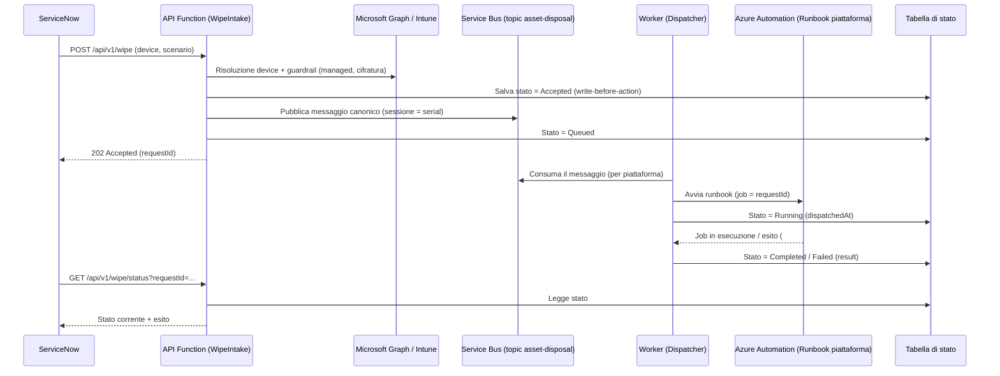

# Asset-Terminator — Flusso di dismissione asset (panoramica)

Documento di sintesi per il cliente. Descrive **cosa fa** la soluzione e **come
scorre** una richiesta di dismissione, senza entrare nei dettagli implementativi.

## 1. Obiettivo

Automatizzare in modo **sicuro, tracciabile e idempotente** la dismissione dei
dispositivi aziendali (Windows, Apple, Android) partendo da una richiesta di
ServiceNow, delegando l'esecuzione del wipe ai runbook di piattaforma già in uso
presso il cliente.

Rispetto alla versione precedente, l'azione distruttiva **non è più eseguita
direttamente dalla Function**: la richiesta viene instradata su una coda
(Azure Service Bus) e un componente di backend fa il **dispatch** verso il
runbook corretto. Questo disaccoppia l'accettazione dall'esecuzione e rende il
sistema più resiliente e scalabile.

## 2. Componenti

| Componente                     | Ruolo                                                                       |
|--------------------------------|-----------------------------------------------------------------------------|
| **API Function** (`WipeIntake`)| Porta d'ingresso HTTP per ServiceNow. Valida, applica i guardrail, accoda.   |
| **Azure Service Bus** (topic)  | Bus di messaggi. Disaccoppia ingresso ed esecuzione, garantisce ordinamento.|
| **Worker Function** (dispatcher)| Legge dalla coda e avvia il runbook di piattaforma su Azure Automation.     |
| **Azure Automation** (runbook) | Esegue il wipe reale, uno script dedicato per piattaforma.                   |
| **Monitor di stato** (`JobMonitor`) | Segue l'avanzamento del job e aggiorna lo stato della richiesta.       |
| **API di stato** (`GetStatus`) | Permette a ServiceNow di consultare lo stato tramite `requestId`.           |
| **Tabella di stato**           | Registro persistente di ogni richiesta (write-before-action, idempotenza).  |

## 3. Flusso end-to-end

## 4. Le fasi in dettaglio

1. **Ingresso e validazione** — ServiceNow chiama `POST /api/v1/wipe`. L'API
   verifica il payload, normalizza il sistema operativo nella piattaforma di
   enrollment (risolvendo l'ambiguo "Mobile" interrogando Intune) e valida lo
   scenario (`Retirement`, `Sale`, `Disposal`, `LostStolen`).

2. **Guardrail di sicurezza** (sola lettura) — controlli rapidi prima di
   qualsiasi azione: il device è gestito da Intune, è cifrato, l'utente ha
   confermato. Se un guardrail fallisce (in modalità reale) la richiesta è
   **respinta** e ServiceNow apre un task manuale.

3. **Persistenza (write-before-action)** — lo stato viene scritto **prima** di
   accodare: se qualcosa va storto a valle, la richiesta resta tracciata e
   ripartibile.

4. **Accodamento** — viene pubblicato un **messaggio canonico** sul topic Service
   Bus. La **sessione** del messaggio è il seriale del device: questo garantisce
   che richieste sullo stesso device siano processate in ordine e senza
   sovrapposizioni. L'API risponde **`202 Accepted`** con il `requestId`.

5. **Dispatch** — il Worker consuma il messaggio dalla sottoscrizione della
   piattaforma corretta (Windows / Apple / Android) e avvia il **runbook**
   dedicato su Azure Automation. Il nome del job coincide con il `requestId`,
   garantendo **idempotenza** (una richiesta = un solo job).

6. **Esecuzione del wipe** — il runbook di piattaforma esegue la dismissione
   (retire/wipe su Intune, rimozione da Autopilot/ABM/Knox secondo lo scenario) e
   restituisce un esito strutturato (contratto `##RESULT##`).

7. **Monitoraggio e chiusura** — il monitor segue il job e aggiorna lo stato
   della richiesta a `Completed` o `Failed`, memorizzando l'esito.

8. **Consultazione** — ServiceNow (o un operatore) consulta lo stato in qualsiasi
   momento tramite `GET /api/v1/wipe/status?requestId=...`.

## 5. Stati di una richiesta

`Accepted` → `Queued` → `Running` → **`Completed`** oppure **`Failed`**
(o **`Rejected`** se un guardrail blocca la richiesta all'ingresso).

## 6. Principi di progetto

- **Disaccoppiamento**: l'ingresso è veloce e non blocca; l'esecuzione avviene in
  modo asincrono tramite coda.
- **Idempotenza**: stesso `requestId` = stesso job, nessuna doppia dismissione.
- **Sicurezza**: guardrail read-only prima di ogni azione; i segreti risiedono
  nelle Automation Variables cifrate, non nel codice.
- **Ordinamento per device**: le sessioni Service Bus serializzano le richieste
  sullo stesso seriale.
- **Tracciabilità**: ogni richiesta è persistita e consultabile end-to-end.
- **Modalità dry-run**: consente di validare l'intero flusso senza eseguire wipe
  reali.

## 7. Sicurezza e rete

- L'API è esposta su HTTPS ed è protetta da **Function Key**.
- Lo storage e il Service Bus sono raggiunti tramite **private endpoint**.
- L'autenticazione verso Microsoft Graph è **app-only con certificato**; le
  credenziali (client id, tenant, thumbprint, chiavi ABM/Knox) sono lette dalle
  **Automation Variables cifrate**.

## 8. Prerequisiti per l'esecuzione reale

Il flusso è stato validato end-to-end in **dry-run**. Per abilitare i wipe reali
occorre completare la configurazione dell'Automation Account:

1. Import del modulo PowerShell **`Microsoft.Graph.Authentication`**
   nel Runtime Environment Automation **PowerShell 7.6**.
2. Caricamento del **certificato** per l'autenticazione app-only a Graph.
3. Valorizzazione delle **Automation Variables segrete** (Graph, ABM per Apple,
   Knox/KME per Android), create cifrate e vuote dal deployment.

> Nota di validazione: il dispatch è stato verificato in ambiente reale — la
> Function worker crea correttamente il job di Automation (nome = `requestId`),
> passa i parametri attesi al runbook di piattaforma e il monitor aggiorna lo
> stato della richiesta. Il job di test è terminato in `Failed` unicamente
> perché i prerequisiti sopra (modulo Graph/certificato) non erano ancora
> presenti nell'Automation Account, confermando la corretta gestione e
> tracciatura degli errori.
