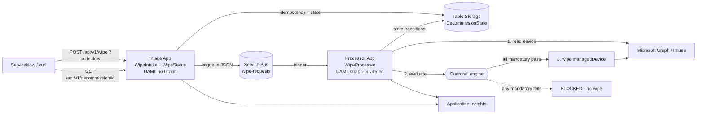

# 🧪 Asset-Terminator POC (PowerShell)

A **minimal, fully PowerShell** proof-of-concept that distills the larger
[`Asset-Terminator`](../README.md) .NET solution down to its essence, so the flow
is easy to read and demo:

> **HTTP request ➜ Service Bus queue ➜ guardrails ➜ Intune wipe**

It intentionally implements only the **wipe** path (no AD/SCCM/Entra delete, no SLA,
no callbacks, no immutable audit) — just enough to make the architecture tangible.

---

## 🏗️ Architecture



**Two separate Function Apps, each with its own User-Assigned Managed Identity**, to
mirror the blast-radius isolation of the full .NET solution:

| App | Trigger(s) | Identity can… | Graph? |
|---|---|---|---|
| **Intake** (internet-facing) | `WipeIntake` (HTTP), `WipeStatus` (HTTP) | send to Service Bus, read/write state table | ❌ none |
| **Processor** (internal) | `WipeProcessor` (Service Bus) | receive from Service Bus, read/write state table, **wipe via Graph** | ✅ `DeviceManagementManagedDevices.Read.All` + `.PrivilegedOperations.All` |

State and idempotency are persisted in a **dedicated Table Storage account** (passwordless,
Entra auth) — replacing the Azure SQL store of the full solution for the subset of
features the POC needs.

---

## 📂 Layout

| Path | Purpose |
|---|---|
| `intake/` | **Intake Function App** package (internet-facing, no Graph). |
| `intake/WipeIntake/` | HTTP trigger: validates, enforces idempotency, writes `Requested` state, enqueues. |
| `intake/WipeStatus/` | HTTP trigger: `GET /api/v1/decommission/{requestId}` — current state + history. |
| `processor/` | **Processor Function App** package (internal, Graph-privileged). |
| `processor/WipeProcessor/` | Service Bus trigger: resolves device, runs guardrails, wipes, writes state transitions. |
| `processor/config/guardrails.config.json` | Enable/disable, thresholds, `Mandatory`/`Warning` mode per guardrail. |
| `*/Modules/Common.psm1` | Logging, Managed Identity token (Graph + Storage), resilient Graph REST wrapper. |
| `*/Modules/StateStore.psm1` | Table Storage state store (REST + MI): idempotency, current state, event history. |
| `processor/Modules/Guardrails.psm1` | **Config-driven guardrail engine** + built-in guardrails. |
| `processor/Modules/IntuneWipe.psm1` | Device lookup (serial+name, freshest) + wipe action (dry-run). |
| `infra/main.bicep` | 2 UAMIs, 2 Flex apps, Service Bus, host storage, dedicated state storage, RBAC. |
| `infra/deploy.ps1` | One-shot deploy: infra ➜ Graph grant (processor only) ➜ publish both packages. |
| `samples/request.json` | Example payload. |

> ℹ️ `Common.psm1` and `StateStore.psm1` are intentionally duplicated into each app
> package (Functions publishes one folder per app). Edit both copies together.

---

## 🚧 How guardrails are handled (the key idea)

Guardrails are **not hardcoded**. Each one is a small PowerShell function following a
convention, and the engine is driven entirely by a JSON config — mirroring the
`IWipeGuardrail` interface of the full .NET solution.

**1. Each guardrail is a function** returning a standard result:

```powershell
function Test-EncryptionGuardrail {
    param($Device, $Settings)
    $ok = [bool]$Device.isEncrypted
    New-GuardrailResult -Name 'Encryption' -Passed $ok -Severity 'Blocking' `
        -Reason ($ok ? 'Device is encrypted.' : 'Device is NOT encrypted.')
}
```

**2. A registry** maps a config name to its function:

```powershell
$GuardrailRegistry = @{
    'Encryption'     = 'Test-EncryptionGuardrail'
    'Inactivity'     = 'Test-InactivityGuardrail'
    'CriticalDevice' = 'Test-CriticalDeviceGuardrail'
}
```

**3. The config decides** what runs, with which thresholds, and whether a failure
blocks the wipe (`Mandatory`) or is just reported (`Warning`):

```json
{
  "guardrails": [
    { "name": "Encryption",     "enabled": true, "mode": "Mandatory", "settings": {} },
    { "name": "Inactivity",     "enabled": true, "mode": "Warning",   "settings": { "minimumInactiveDays": 14 } },
    { "name": "CriticalDevice", "enabled": true, "mode": "Mandatory", "settings": { "blockedCategories": ["Executives","Servers"] } }
  ]
}
```

**Decision rule:** `Invoke-Guardrails` runs every enabled guardrail; the wipe proceeds
only if **no `Mandatory` guardrail fails**. Guardrails that throw are treated as a
blocking failure (**fail-closed**).

### ➕ Add your own guardrail (no recompilation)
1. Write `Test-MyRuleGuardrail -Device -Settings` in `processor/Modules/Guardrails.psm1`.
2. Add it to `$GuardrailRegistry`.
3. Add an entry in `processor/config/guardrails.config.json`.

Examples you could add: *primary user must be disabled*, *device not in a critical
Entra group* (needs `Directory.Read.All`), *device offline > N days*, *not a VIP asset*.

---

## 🔒 Safety: dry-run by default

The wipe is **simulated unless `dryRun` is explicitly `false`**. The intake defaults
`dryRun = true` when the field is omitted, so accidental calls never destroy a device.

---

## 🚀 Deploy

```powershell
cd poc-powershell/infra
./deploy.ps1 -ResourceGroup ASSET-TERMINATOR-POC-RG -Location northeurope
```

The script provisions the infrastructure, grants the two Graph app roles to the
**processor** identity only (requires an Entra admin — use `-SkipGraphConsent`
otherwise), and publishes both app packages (`-SkipPublish` to skip).

Prerequisites: Azure CLI, Azure Functions Core Tools v4, PowerShell 7.4.

---

## 📨 Invoke

```powershell
$app  = 'attpoc-intake-dev'
$key  = az functionapp keys list -g ASSET-TERMINATOR-POC-RG -n $app --query functionKeys.default -o tsv
$body = Get-Content ../samples/request.json -Raw

# Submit (idempotent on requestId)
Invoke-RestMethod -Method Post `
  -Uri "https://$app.azurewebsites.net/api/v1/wipe?code=$key" `
  -ContentType 'application/json' -Body $body
# -> 202 Accepted { status: Accepted, requestId, correlationId, dryRun }
#    a duplicate requestId returns 200 { status: AlreadyAccepted, overallStatus, ... }

# Poll status (ServiceNow polling model)
$rid = ($body | ConvertFrom-Json).requestId
Invoke-RestMethod -Uri "https://$app.azurewebsites.net/api/v1/decommission/$rid?code=$key"
# -> { overallStatus, detail, createdAt, lastUpdatedAt, history: [ { status, timestamp } ] }
```

Typical state flow: **Requested ➜ InProgress ➜ Completed** (dry-run) / **Blocked**
(guardrails) / **Failed** (device not found or error). Follow execution in
**Application Insights** (`attpoc-appi-dev`): each step is logged as a structured
entry with the same `correlationId`.

### State & idempotency (Table Storage)

The dedicated state account persists one row per request (`PartitionKey=requestId`,
`RowKey=state`) plus append-only `evt-*` event rows for history. `WipeIntake` uses an
atomic insert to guarantee **idempotency**: a repeated `requestId` is never enqueued
twice and returns the original `correlationId`. This covers the subset of the full
.NET state machine the POC needs; what it does **not** cover (callbacks, async wipe
polling over days, SLA/VIP, guardrail override) remains the rationale for the full
solution.

### Device resolution (serial + name, freshest wins)

ServiceNow sends the **serialNumber together with the deviceName**. The request body
accepts `managedDeviceId`, `deviceName` and/or `serialNumber` (at least one required):

```jsonc
{
  "requestId": "SNOW-INC0012345",
  "deviceName": "LAPTOP-CONTOSO-01",
  "serialNumber": "5CG1234XYZ",
  "dryRun": true
}
```

`Get-IntuneManagedDevice` builds a combined Graph `$filter`
(`deviceName eq '…' and serialNumber eq '…'`) and narrows the results client-side.
Because re-enrollment / re-imaging can leave **several stale objects** with the same
name and serial, when more than one device matches we never pick an arbitrary one —
`Select-FreshestManagedDevice` selects the **freshest**:

1. most recent `enrolledDateTime`, then
2. most recent `lastSyncDateTime` (check-in) as tie-breaker.

Missing/null dates sort as the oldest, and the selection is logged (count of matches +
the resolved `serialNumber`, `enrolledDateTime`, `lastSyncDateTime`) for audit.

---

## 🔁 How it maps to the full solution

| POC (PowerShell) | Full solution (.NET) |
|---|---|
| `WipeIntake` HTTP trigger | `AssetTerminator.Api` intake endpoint |
| Service Bus `wipe-requests` | Service Bus orchestration/cloud queues |
| `WipeProcessor` | Durable orchestrator + Intune provider |
| `Guardrails.psm1` + JSON | `AssetTerminator.Guardrails` (`IWipeGuardrail`) |
| `dryRun` | `DecommissionRequest.dryRun` |
| App Insights logs | Log Analytics custom tables + Workbook |

What the POC deliberately leaves out: AD/SCCM/Entra deletes, immutable WORM audit,
async polling/give-up, SLA tiers, RBAC override, and ServiceNow callbacks.
