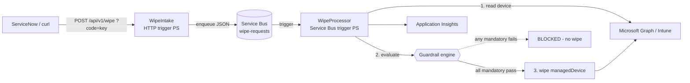

# 🧪 Asset-Terminator POC (PowerShell)

A **minimal, fully PowerShell** proof-of-concept that distills the larger
[`Asset-Terminator`](../README.md) .NET solution down to its essence, so the flow
is easy to read and demo:

> **HTTP request ➜ Service Bus queue ➜ guardrails ➜ Intune wipe**

It intentionally implements only the **wipe** path (no AD/SCCM/Entra delete, no SLA,
no callbacks, no immutable audit) — just enough to make the architecture tangible.

---

## 🏗️ Architecture



Two functions in **one PowerShell Function App**, plus a Service Bus namespace and a
system-assigned **Managed Identity** holding the only sensitive Graph permission:
`DeviceManagementManagedDevices.PrivilegedOperations.All`.

---

## 📂 Layout

| Path | Purpose |
|---|---|
| `WipeIntake/` | HTTP trigger: validates the request and enqueues it (Service Bus output binding). |
| `WipeProcessor/` | Service Bus trigger: resolves the device, runs guardrails, performs/simulates the wipe. |
| `Modules/Common.psm1` | Logging, Managed Identity Graph token, resilient Graph REST wrapper (retry/backoff). |
| `Modules/Guardrails.psm1` | **Config-driven guardrail engine** + built-in guardrails. |
| `Modules/IntuneWipe.psm1` | Device lookup + wipe action (with dry-run). |
| `config/guardrails.config.json` | Enable/disable, thresholds, and `Mandatory`/`Warning` mode per guardrail. |
| `infra/main.bicep` | Service Bus, Storage, Consumption plan, PS Function App, App Insights, RBAC. |
| `infra/deploy.ps1` | One-shot deploy: infra ➜ Graph app-role grant ➜ code publish. |
| `samples/request.json` | Example payload. |

---

## 🚧 How guardrails are handled (the key idea)

Guardrails are **not hardcoded**. Each one is a small PowerShell function following a
convention, and the engine is driven entirely by a JSON config — mirroring the
`IWipeGuardrail` interface of the full .NET solution.

**1. Each guardrail is a function** returning a standard result:

```powershell
function Test-EncryptionGuardrail {
    param($Device, $Settings)
    $ok = [bool]$Device.isEncrypted
    New-GuardrailResult -Name 'Encryption' -Passed $ok -Severity 'Blocking' `
        -Reason ($ok ? 'Device is encrypted.' : 'Device is NOT encrypted.')
}
```

**2. A registry** maps a config name to its function:

```powershell
$GuardrailRegistry = @{
    'Encryption'     = 'Test-EncryptionGuardrail'
    'Inactivity'     = 'Test-InactivityGuardrail'
    'CriticalDevice' = 'Test-CriticalDeviceGuardrail'
}
```

**3. The config decides** what runs, with which thresholds, and whether a failure
blocks the wipe (`Mandatory`) or is just reported (`Warning`):

```json
{
  "guardrails": [
    { "name": "Encryption",     "enabled": true, "mode": "Mandatory", "settings": {} },
    { "name": "Inactivity",     "enabled": true, "mode": "Warning",   "settings": { "minimumInactiveDays": 14 } },
    { "name": "CriticalDevice", "enabled": true, "mode": "Mandatory", "settings": { "blockedCategories": ["Executives","Servers"] } }
  ]
}
```

**Decision rule:** `Invoke-Guardrails` runs every enabled guardrail; the wipe proceeds
only if **no `Mandatory` guardrail fails**. Guardrails that throw are treated as a
blocking failure (**fail-closed**).

### ➕ Add your own guardrail (no recompilation)
1. Write `Test-MyRuleGuardrail -Device -Settings` in `Modules/Guardrails.psm1`.
2. Add it to `$GuardrailRegistry`.
3. Add an entry in `config/guardrails.config.json`.

Examples you could add: *primary user must be disabled*, *device not in a critical
Entra group* (needs `Directory.Read.All`), *device offline > N days*, *not a VIP asset*.

---

## 🔒 Safety: dry-run by default

The wipe is **simulated unless `dryRun` is explicitly `false`**. The intake defaults
`dryRun = true` when the field is omitted, so accidental calls never destroy a device.

---

## 🚀 Deploy

```powershell
cd poc-powershell/infra
./deploy.ps1 -ResourceGroup ASSET-TERMINATOR-POC-RG -Location northeurope
```

The script provisions the infrastructure, grants the two Graph app roles to the
Function App identity (requires an Entra admin — use `-SkipGraphConsent` otherwise),
and publishes the code (`-SkipPublish` to skip).

Prerequisites: Azure CLI, Azure Functions Core Tools v4, PowerShell 7.4.

---

## 📨 Invoke

```powershell
$app  = 'attpoc-func-dev'
$key  = az functionapp keys list -g ASSET-TERMINATOR-POC-RG -n $app --query functionKeys.default -o tsv
$body = Get-Content ../samples/request.json -Raw

Invoke-RestMethod -Method Post `
  -Uri "https://$app.azurewebsites.net/api/v1/wipe?code=$key" `
  -ContentType 'application/json' -Body $body
# -> 202 Accepted { status, requestId, correlationId, dryRun }
```

Follow execution in **Application Insights** (`attpoc-appi-dev`): each step
(accepted ➜ guardrail PASS/FAIL ➜ BLOCKED or wipe outcome) is logged as a structured
entry with the same `correlationId`.

---

## 🔁 How it maps to the full solution

| POC (PowerShell) | Full solution (.NET) |
|---|---|
| `WipeIntake` HTTP trigger | `AssetTerminator.Api` intake endpoint |
| Service Bus `wipe-requests` | Service Bus orchestration/cloud queues |
| `WipeProcessor` | Durable orchestrator + Intune provider |
| `Guardrails.psm1` + JSON | `AssetTerminator.Guardrails` (`IWipeGuardrail`) |
| `dryRun` | `DecommissionRequest.dryRun` |
| App Insights logs | Log Analytics custom tables + Workbook |

What the POC deliberately leaves out: AD/SCCM/Entra deletes, immutable WORM audit,
async polling/give-up, SLA tiers, RBAC override, and ServiceNow callbacks.
